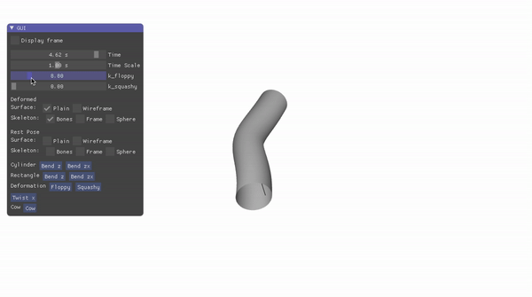

# Simplified Velocity Skinning

- [Introduction](#Introduction)
- [Requirements](#Requirements)
- [An illustration](#Anillustration)

### Introduction

This repository is the result of our animation course project and is meant to present a simplified implementation of [velocity skinning project](https://velocityskinning.com/).

The goal of the original paper is to add exagerated deformation triggered by skeletal velocity on top of standard skinning animation, so that the animation would appear more loose. The method takes a standard skeleton animation as input, along with a skin mesh and rig weights, and then derives per-vertex deformations from the different linear and angular velocities along the skeletal hierarchy. The method has the advantage of being performed over existing skinning data, which can be a huge time saver for animation process.

### Requirements

The code uses [CGP library](https://github.com/drohmer/CGP). This latter is a lightweight and minimalist C++ library using OpenGL to represent, animate, and interact with 3D scenes.

You first need to clone the [CGP library](https://github.com/drohmer/CGP) and then change the `PATH_TO_LIBRARY` parameter `Animation_Khayatan_Shilova/CMakeLists.txt` to your relative path to library folder of the CGP. You can then folllow these [installation instructions](https://imagecomputing.net/cgp/compilation/content/01_compilation/index.html) to properly install dependencies and compile the library.

### An illustration

